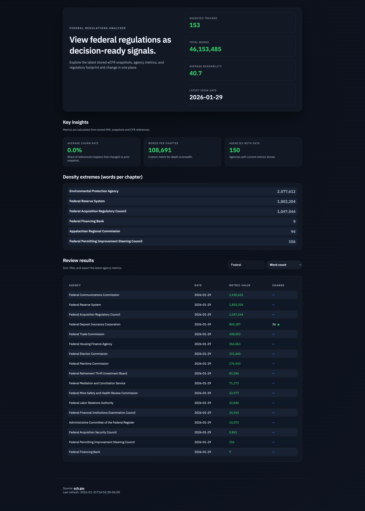
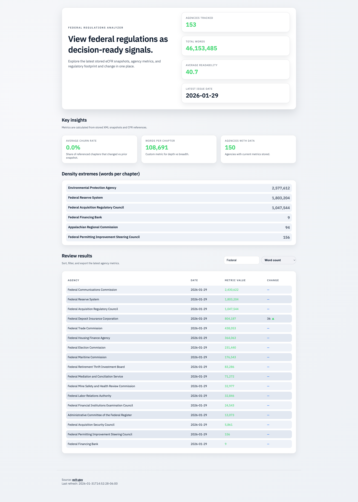

# eCFR Project

## Purpose
The United States Federal Government has over 200,000 pages of federal regulations across ~150 main agencies, all of which can be found within the eCFR at https://www.ecfr.gov/. There is a public API for it.
The goal of this project is to create a simple website to analyze Federal Regulations to allow for more digestible and actionable insights to be made on potential deregulation efforts across the government.

## What This Project Implements
- Data ingestion from the eCFR API and storage in a local SQLite database and gzip-compressed XML snapshots.
- API endpoints for agencies, metrics, and refresh state.
- UI for reviewing agency metrics.
- Metrics implemented:
  - `word_count` (per agency)
  - `words_per_chapter` (per agency)
  - `checksum` (per agency)
  - `readability` (Flesch Reading Ease)
  - `churn` (custom metric): ratio of agency-referenced chapters whose content changed compared to the previous snapshot, best-effort based on available prior data.

## Local Setup
### Prerequisites
- Go 1.25.6

### Install Dependencies
```bash
go mod tidy
```

### Build and Run the Server (and Website)
The server also serves the static website from `ecfr-analytics/web`.
```bash
cd ecfr-analytics
go build ./cmd/server
go run ./cmd/server
```

By default it listens on `http://localhost:8080`.

### Notes on First Run
- The server will kick off a background refresh on startup and then refresh daily.
- The initial download can take several minutes depending on network speed.
- Data is stored under `ecfr-analytics/data`.

## Screenshots

| Dark Mode | Light Mode |
|----------|------------|
|  |  |

## License

Proprietary Software

© 2026 SarahUniverse

This software and its source code are the exclusive property of SarahUniverse. No part of this software may be reproduced, distributed, or transmitted in any form or by any means without prior written permission.
